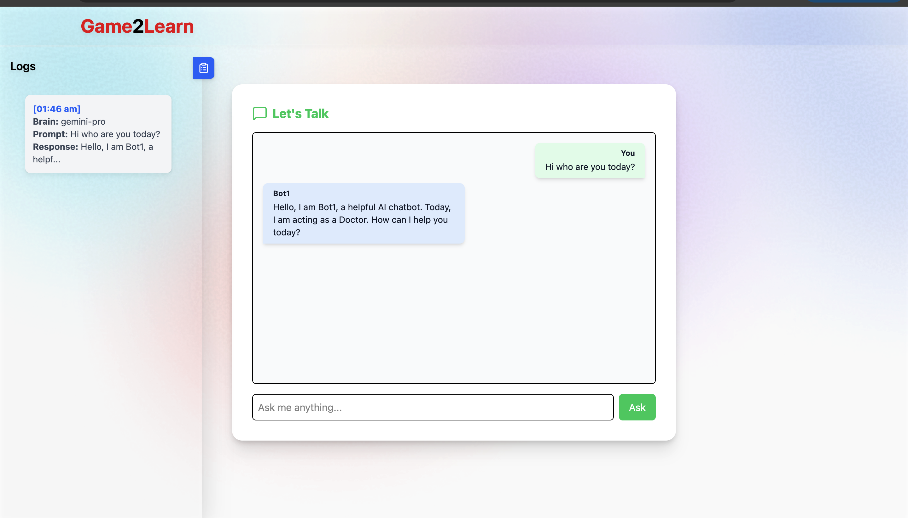

## Chatbot Builder

An interactive, full-stack chatbot application that allows users to configure their own AI bot with a name, persona, and model (e.g., GPT-4o, Gemini-Pro).

---

## Live Demo

🌐 Hosted here: [https://yashdive.github.io/chatbot-builder/](https://yashdive.github.io/chatbot-builder/)

---

## Screenshots

### 💬 Chat Interface + Logs



---


## 🛠️ Tech Stack

| Layer       | Tech Used             |
|-------------|------------------------|
| Frontend    | React + Tailwind CSS   |
| Routing     | React Router DOM       |
| Animation   | Framer Motion          |
| Icons       | Lucide React           |
| Markdown    | React Markdown         |
| LLM API     | Gemini API (can be switched to OpenAI) |
| Logging     | Client-side state (extendable to backend DB) |

---

## 💻 How to Run Locally

1. **Clone the Repo**

```bash
git clone https://github.com/yashdive/chatbot-builder.git
cd chatbot-builder
```

2. **Install Dependencies**

```bash
npm install
```

3. **Configure Environment Variables**

Create a .env file in the root:

```bash
VITE_GEMINI_API_URL='https://generativelanguage.googleapis.com/v1beta/models/gemini-2.0-flash:generateContent?key='
VITE_GEMINI_API_KEY=your_api_key_here
```

4. **Run the App**

```bash
npm run dev
```


